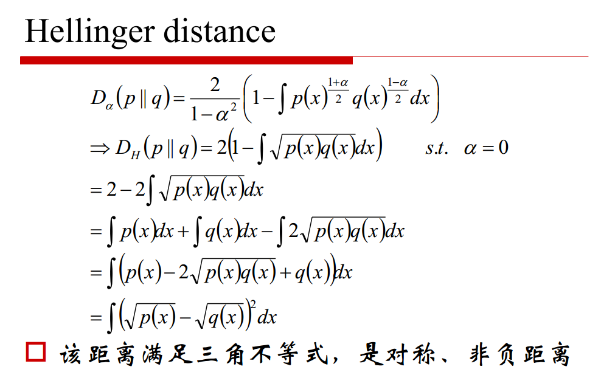
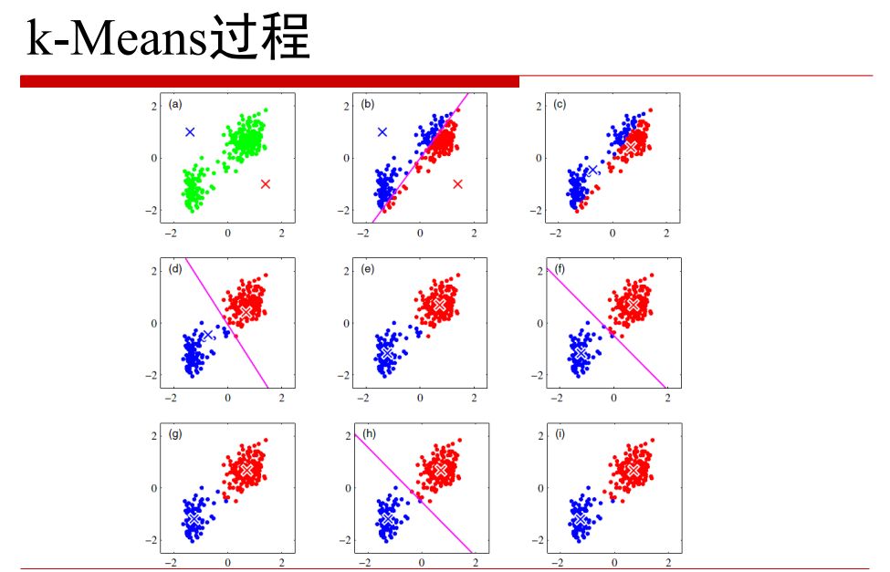

# 聚类（上）

## 目标：
1. 理解相似度度量的各种方法及相互联系
2. 掌握K-means聚类的思路和使用条件
3. 层次聚类的思路和方法
4. 聚类指数及其意义

## 聚类的作用：
- 聚类就是对大量未知标注的数据集，按数据的内在相似性将数据集划分为多个类别，使类别内的数据相似度较大而类别间的数据相似度较小。
- 无监督

## 聚类的基本思想：
- 给定一个有N个对象的数据集，构造数据的k个簇，k≤N。满足如下条件
1. 每个簇至少包含一个对象
2. 每一个对象只属于有且仅有一个簇
3. 将满足上述两个条件的k个簇称作一个合理划分

- 基本思想
  对于给定的类别数目k，首先给出初始划分，通过迭代改变样本和簇的隶属关系，使得每一次改进之后的划分方案都比前一次的好
  
---
## 相似度/距离计算方法总结

- 欧式距离

，即二范式。

，即n范式。

- 杰卡德相似度系数

，通常降低热门元素的权重，提高冷门元素的权重。

- 余弦相似度

- pearson相似度

- 相对熵（K-L距离）

- Hellinger-distance

---

## K-Means算法

- K-Means默认满足混合高斯分布，即图像是凸的，K-Means算法的聚类效果比较好。
- 算法流程：
1. 给出先验值：k个类别中心（k为分类的种类数量）
2. 求出每个类别中心与其他对象距离的平均值，取平均值最小的序列
3. 对上述的每个序列，求出平均值，作为新的类别中心
4. 反复迭代2、3，直到满足某个条件（如：迭代次数/中心变化率/均方差），程序结束。

- 多次取不同的初值，可以避免聚类效果不佳

## K-Means++算法
由于K-Means算法对初值敏感，虽然可以通过多次取不同的初值进行训练来避免聚类效果不佳的问题。但是，当数据量十分大时，这个样的做法是不可取的。

K-Means++算法就是在K-Means的基础上选取初值的一种算法。k-means++算法选择初始seeds的基本思想就是：初始的聚类中心之间的相互距离要尽可能的远。

- 算法流程
1. 从输入的数据点集合中随机选择一个点作为第一个聚类中心
2. 对于数据集中的每一个点x，计算它与最近聚类中心(指已选择的聚类中心)的距离D(x)
3. 选择一个新的数据点作为新的聚类中心，选择的原则是：D(x)较大的点，被选取作为聚类中心的概率较大
4. 重复2和3直到k个聚类中心被选出来
5. 利用这k个初始的聚类中心来运行标准的k-means算法
